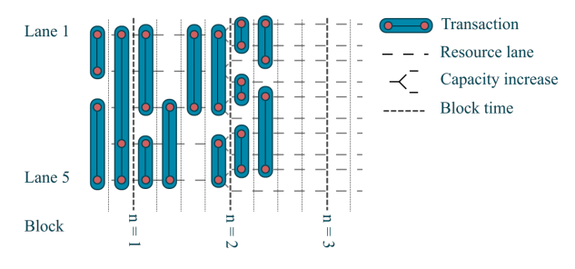

# Architecture

This section describes at a high level how the Fetch.ai ledger operates; for full understanding of the ledger architecture please read [the yellow paper](https://fetch.ai/wp-content/uploads/2019/10/Fetch.AI-Ledger-Yellow-Paper.pdf). We assume the reader is comfortable with concepts that underpin blockchain technology such as public key cryptography, consensus and smart contracts.

!!! note
    This is work in progress.

The following diagram gives a high level overview of the components a node consists of. The entry point is the __Constellation__ application; every time a node is deployed in the network, an instance of this application is created. Please read [this section](running-a-constellation.md) for more information about how to run a node.

The __block coordinator__ inside each node is responsible for adding new blocks to its copy of the chain, while preserving its consistency. In order to do so, it advances along the chain to find the longest/heaviest branch, and drops the ones that are not. After reaching the heaviest block, the block coordinator asks the executor(s) and consensus for help to add a new block, which contains a set of transactions.

__Consensus__ is responsible for building a block that will be considered correct, e.g. with a timestamp greater than that of the heaviest block in the chain.

The __executor__ takes said block, iterates through all the transactions packed within it, and for each of them:

1. It determines if the transaction is valid, has paid the required fees, etc.
2. Since conceptually a transaction is a state change in blockchain, it updates the state accordingly.

Blocks are then exchanged between nodes via a __block synchronization protocol__. Consensus is also responsible for verifying that blocks received this way are correct.

## Sharding

In order to prevent attacks such as [double spending](https://en.wikipedia.org/wiki/Double-spending), transactions in a blockchain are executed in a strict, sequential order, thus ensuring that access to any given resource is strictly sequential. On a traditional decentralized ledger, this ordering of transactions must be identical across all the nodes that replicate the process.

The Fetch.ai ledger relaxes the requirement on sequential execution by partitioning resources into mutually disjoint subsets called __resource groups__. Transactions that affect resources from different groups are then handled by separate __resource lanes__. The ledger defines a complete ordering of transactions belonging to a given lane, but not across lanes. A strict temporal ordering of transactions, including simultaneous execution of non-conflicting events, is achieved by entering transactions into a novel block structure.

In order to understand better how resources lanes work, let's take a look at the following example:

Dashed horizontal lines represent resource lanes. Vertical cyan bars denote transactions that involve resources (magenta circles) from one or more lanes. Groups of compatible transactions are arranged into block slices, demarcated by vertical lines, and can be executed simultaneously. For example, in the first block slice, the transaction involving resource groups 1 and 2 can be executed at the same time as the transaction that involves groups 3 and 5. This feature allows the ledger to scale its throughput to accommodate an arbitrary number of transactions.

The bold vertical lines represent the putative boundaries of blocks that are to be entered into the blockchain. Each block contains a fixed number of slices, which we refer to as the slice number. The lane number, which specifies the other dimension of the block undergoes a doubling after the boundary of the second block, leading to a concomitant doubling of the transaction throughput. As a consequence of this design, the size of a block can vary by increasing or decreasing the number of shards. This allows the network to balance block sizes against economic incentives, for example.

This blockchain sharding design speeds up the network as contracts can execute concurrently, providing a solution to the blockchain scalability problem. Furthermore, resource lanes serve a similar purpose as sharding in conventional databases, and reduce the minimum storage requirements on the smallest processing node on the network. The number of lanes can also be adjusted according to the transaction load.

## HTTP pages and API

!!! note
    Coming soon

## Networking

!!! note
    Coming soon

 
